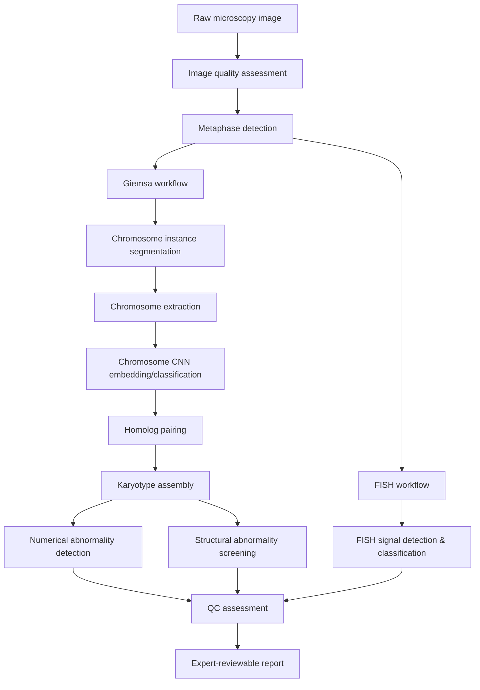

# KaryoAI Architecture v2 — Deep-Learning Track

**Status: Phase 1 (repository refactor + dataset API + Mask R-CNN segmentation scaffold). Nothing described here is trained on real data yet.**

This document describes the target architecture from the DNN upgrade spec and, for each piece, what actually exists today versus what's still ahead.

## Pipeline overview

## Stage-by-stage status

| Stage | Spec section | Status |
|---|---|---|
| Classical baseline (thresholding + connected components) | — | **Working.** `karyo_ai/` package, unchanged by this track. |
| Dataset abstraction (COCO-style) | 14–15 | **Built.** `karyo_ai_dnn/datasets/coco_dataset.py`. Supports polygon segmentation (for CVAT/LabelMe-style exports) and a `mask_file` reference form (for our own converter/generator). RLE segmentation is not supported yet. |
| Synthetic test dataset | 10, 30 | **Built.** `karyo_ai_dnn/datasets/synthetic.py` generates COCO-format synthetic metaphases (configurable species/count), covering the human-46, mouse-40, missing-chromosome, and extra-chromosome cases from spec section 30. It does not cover overlapping/touching or fragmented chromosomes yet — each blob is placed non-overlapping by construction. |
| PNG-mask → dataset converter | 15 | **Built**, PNG-mask input only. CVAT and LabelMe converters are not implemented. |
| Mask R-CNN segmentation (Stage A: chromosome vs. background) | 2–3 | **Code complete, untrained.** `karyo_ai_dnn/models/maskrcnn.py` + `train_maskrcnn.py` + `predict_maskrcnn.py`. Verified end-to-end on synthetic data (builds, one CPU training step, one inference step — see `tests/test_maskrcnn_smoke.py`). Not trained on any real chromosome image. Training real weights needs (a) a GPU — this was built in a 1-CPU-core sandbox with no CUDA — and (b) an annotated real dataset, neither of which exist yet. |
| Chromosome identity CNN (Stage B) | 4 | **Not started.** `karyo_ai_dnn/species.py` has the species config (human 1–22/X/Y, mouse 1–19/X/Y) this stage will need, but no classifier exists. |
| Homolog pairing | 6 | Not started. |
| Karyotype assembly (DNN track) | 7 | Not started. The classical baseline's own assembly (`karyo_ai/assembly.py`) is unrelated and unaffected. |
| Aneuploidy detection | 8 | Not started. |
| Structural abnormality screening | 9 | Not started. |
| FISH workflow | 10–11 | Not started. |
| QC model | 13 | Not started (classical baseline has its own simpler QC in `karyo_ai/preprocessing.py`, unrelated). |
| Training pipeline / strategy | 16–19 | Training script exists (`train_maskrcnn.py`) with CUDA/MPS/CPU auto-detect, `--resume`, config-file defaults. Phased freeze/unfreeze strategy (section 17) is not implemented — right now it's a plain single-phase fine-tune loop. |
| Evaluation (`evaluate_segmentation.py`) | 19 | Not started. |
| Dataset-splitting-by-sample rule | 20 | Not implemented — no real dataset to split yet. Flagging now so it isn't forgotten once real data arrives: split by image/metaphase/sample, never by individual chromosome. |
| Expert review interface | 23 | Not started. |
| Active learning | 24 | Not started. |
| Explainability (Grad-CAM) | 25 | Not started. |
| `karyoai` unified CLI | 27 | Not started — currently separate scripts (`train_maskrcnn.py`, `predict_maskrcnn.py`) rather than subcommands. |
| Model registry | 29 | Not started. |
| Automated tests | 30 | Partial. `tests/test_dataset.py` and `tests/test_maskrcnn_smoke.py` cover dataset generation/loading and model build/train/inference smoke-testing, all synthetic, all CPU. Missing: test_classifier, test_pairing, test_karyotype, test_aneuploidy, test_fish, test_qc, test_reporting (all depend on stages that don't exist yet). |

## Design decisions worth flagging

- **Stage A/B separation is real, not just a comment.** `build_maskrcnn(num_classes=2, ...)` only ever sees `{background, chromosome}`. There is nowhere in the current code that a 46-way or 40-way class head could accidentally get created — chromosome identity has no model yet, by construction.
- **`weights=None` alone does not mean offline.** `torchvision.models.detection.maskrcnn_resnet50_fpn` defaults `weights_backbone` to an ImageNet-pretrained ResNet-50 regardless of the top-level `weights` argument, and will try to download it even when you only meant to skip the *detection* pretraining. `build_maskrcnn` explicitly passes `weights_backbone=None` too when `pretrained=False`. This was caught by running the offline smoke test in a network-restricted sandbox, not by code review — worth remembering if this function gets refactored.
- **`karyo_ai_dnn` is fully additive.** Nothing in `karyo_ai/` (the classical baseline) was changed to build this. `karyo_ai_cli.py` and `streamlit_app.py` still work exactly as before.
- **Segmentation storage uses `mask_file` references, not COCO RLE/polygon, for machine-generated masks.** Polygon segmentation is supported for reading (e.g. CVAT/LabelMe exports), but our own generator and converter emit direct mask-file references instead of tracing polygons, since that's lossless and avoids adding a contour-tracing dependency for Phase 1. A true polygon/RLE exporter for external COCO-tool compatibility is future work, not silently missing.

## Known limitations of this phase

- No GPU was available while building this (1 CPU core, no CUDA/MPS) — model-building and one training/inference step were verified on CPU with tiny synthetic images; real training throughput on this hardware would not be practical.
- No real annotated chromosome images were used or are available in this environment. Everything tested against `karyo_ai_dnn/datasets/synthetic.py`'s generated blobs.
- No network path to `download.pytorch.org` was available in this environment either, so `pretrained=True` (COCO/ImageNet weight loading) is untested here — only the `pretrained=False` offline path was exercised. It should work in a normal environment with internet access, but that's an assumption, not something this session verified.
